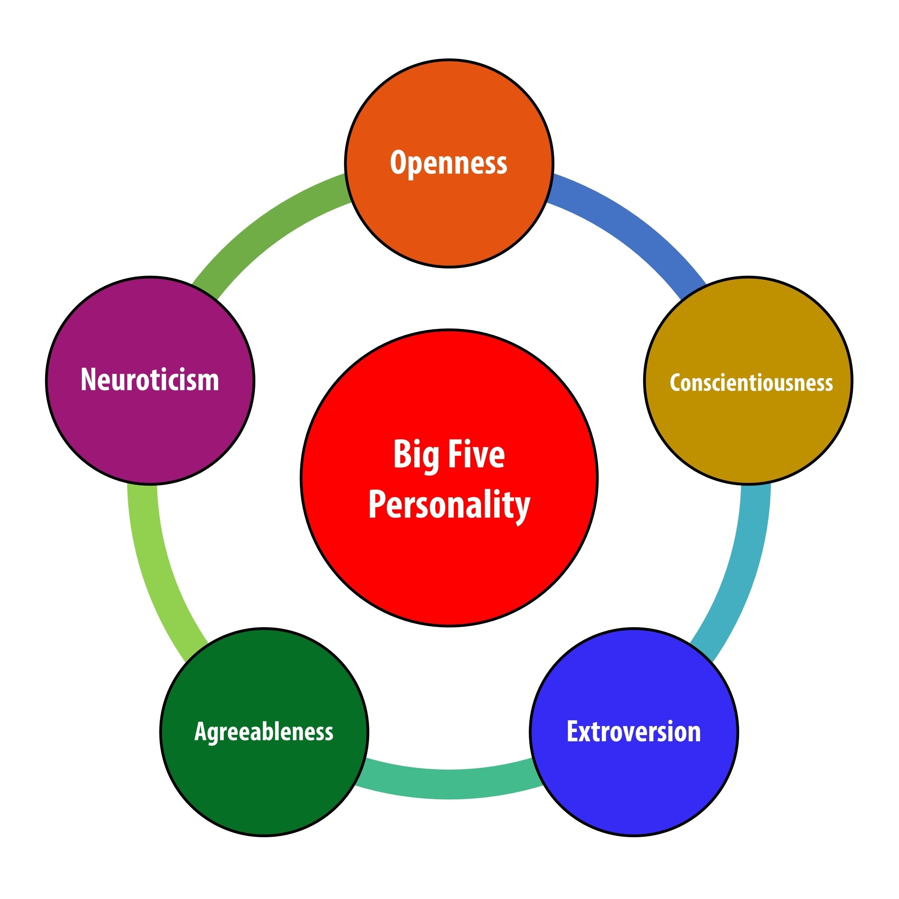
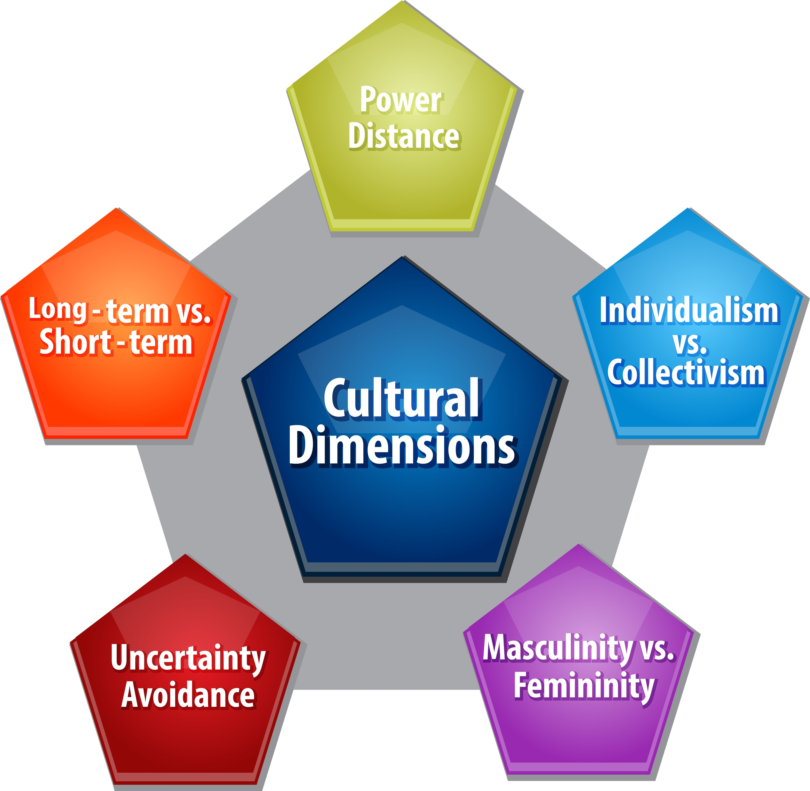

# 🧐 Personality and Values 

## What Is Personality?
Definition: The sum of ways in which an individual reacts to and interacts with the world around them.  

**Personality Traits:** These are the enduring characteristics (consistent over time and across situations) that describe an individual's behavior (e.g., "fun," "hard-working," or "aloof").    

**Cultural Influence:** While many traits (like the Big Five) emerge across cultures, some traits are unique to specific cultural contexts (e.g., traits focused on interpersonal relatedness in Chinese contexts).  
This demonstrates that personality is not just a universal psychological structure but is also shaped by the dominant cultural values of a society.  

## Measuring Personality
**Purpose:** Used extensively in hiring and training to forecast who is best for a job.

**Methods:**
### Self-Report Surveys:    
The most common method. Individuals rate themselves on factors (e.g., "I worry a lot about the future").

**Problem:** Individuals may "fake" responses to rate themselves higher on desirable traits when applying for a job.

### Observer-Ratings Surveys:   
A coworker or another observer does the rating.  

**Value:** Research suggests these surveys predict job success better than self-reports alone and can provide unique insight into behavior. A combination of self and observer ratings is best.

### Technology and AI:  
Modern techniques use machine learning to improve scoring, reduce faking, and even measure personality through language used on social media or in personal essays.

## 1. Personality & its Determinants    
**Personality** is the unique combination of psychological characteristics that measureable influence how a person interacts with others and reacts to situations. It refers to the enduring patterns of behavior and thought that are characteristic of an individual.

### 🧠 Determinants of Personality   
Personality is generally considered to be the result of both heredity and environment.

####  **Heredity (Biological Factors):**    
This refers to factors determined at conception. It includes a person's biological, physiological, and inherent psychological makeup.   

**Example:** Studies of identical twins separated at birth often show striking similarities in their temperaments, even when raised in vastly different environments, suggesting a strong genetic component to traits like shyness or emotional stability.

#### **Environment (Situational Factors):**     
This includes the culture, family, social groups, and experiences we are exposed to over a lifetime. 

**Example:** A person with a naturally high-energy temperament (heredity) who is raised in a strict, traditional culture (environment) might develop a more reserved and disciplined personality than if they were raised in a more permissive, expressive culture.

## 2. MBTI & Big Five Personality Model   
These are two of the most popular frameworks used to categorize and understand personality.

### A. The Myers-Briggs Type Indicator (MBTI)   
The MBTI is a personality assessment that uses four key dichotomies (pairs of opposing preferences) to classify people into one of 16 personality types (e.g., ISTJ, ENFP).

| Dimension | Description | Example Preference |
| --- | --- | --- |
| **E/I (Extraversion/Introversion)** | Where do you focus your energy? | **E:** Energy from outside world, social interaction. **I:** Energy from inner world, reflection. |
| **S/N (Sensing/Intuition)** | How do you gather information? | **S:** Focus on facts, details, and the present. **N:** Focus on possibilities, big picture, and future. |
| **T/F (Thinking/Feeling)** | How do you make decisions? | **T:** Logic, objective criteria, analysis. **F:** Values, personal concern, impact on others. |
| **J/P (Judging/Perceiving)** | How do you prefer to live your life? | **J:** Planned, organized, decisive, closure. **P:** Flexible, spontaneous, open-ended, adaptable. |
  

* **Example:** An **ISTJ** (Introverted, Sensing, Thinking, Judging) is often described as a **"Logistician"**—practical, fact-minded, and reliable. They would excel in roles requiring meticulous attention to detail, like accounting or engineering.

### B. The Big Five Personality Model   
This model states that five basic dimensions underlie all others and encompass most of the significant variations in human personality. Research has shown these traits are highly stable and predict job performance.  

| Trait | Description | High Score Example | Low Score Example |
| --- | --- | --- | --- |
| **1. Conscientiousness** | A measure of reliability. | Organized, careful, responsible, disciplined. | Careless, disorganized, easily distracted. |
| **2. Agreeableness** | An individual's propensity to defer to others. | Cooperative, warm, trusting, good-natured. | Cold, antagonistic, suspicious, uncooperative. |
| **3. Neuroticism (Emotional Stability)** | A person's ability to withstand stress. (The opposite of emotional stability). | Calm, secure, self-confident (low score). | Anxious, depressed, insecure, highly reactive (high score). |
| **4. Openness to Experience** | The range of a person’s interests and fascination with novelty. | Creative, curious, artistic, intellectual. | Conventional, comfortable with the familiar, practical. |
| **5. Extraversion** | Comfort level with relationships. | Sociable, gregarious, assertive, outgoing. | Reserved, timid, quiet, solitary. |

* **Example:** A salesperson with **high Extraversion** and **high Conscientiousness** is likely to be highly effective. Their high Extraversion makes them comfortable engaging with clients, and their high Conscientiousness ensures they follow up, organize their leads, and meet deadlines.
 

   

## Dark Traid 
 - Machiavellianism
 - Narcissism
 - Psycopathy

## 3. Other Personality Traits  
Beyond the Big Five,  several other traits are highly relevant to organizational behavior:

### **Core Self-Evaluation (CSE):**   
The degree to which individuals like or dislike themselves, see themselves as effective, capable, and in control of their environment.  

* **Example:** An employee with **high CSE** would confidently volunteer to lead a challenging project, believing they have the skills and influence to succeed.

### **Machiavellianism:**    
The degree to which an individual is pragmatic, maintains emotional distance, and believes ends can justify means.

* **Example:** A manager **high in Machiavellianism** might intentionally withhold key information from a colleague competing for the same promotion, viewing it as a necessary tactic to achieve their goal.

### **Narcissism:**    
The tendency to be arrogant, have an exaggerated sense of self-importance, require excessive admiration, and possess a sense of entitlement.
* **Example:** A **narcissistic** leader might take full credit for their team's successful outcome while blaming a single low-performing individual for any setback.

### **Self-Monitoring:**    
An individual's ability to adjust their behavior to external, situational factors.
* **Example:** A **high self-monitor** can seamlessly switch between being formal and serious in a meeting with senior executives and being casual and humorous with their immediate team, depending on the social cues.

### **Risk-Taking:** 
The willingness to take chances.
* **Example:** A **high risk-taker** would be drawn to a start-up company with high potential reward but high chance of failure, while a low risk-taker would prefer a stable, established corporation.

### **Type A vs. Type B Personality:**
* **Type A:** Characterized by excessive competitive drive, a chronic sense of urgency, and impatience.
* **Type B:** Rarely harried by a sense of urgency and often focuses on quality over quantity.

    

---

## 4. Values 

### Terminal vs. Instrumental  

**Values** are basic convictions that a specific mode of conduct or end-state of existence is personally or socially preferable to an opposite or converse mode of conduct or end-state of existence. They are the foundation for attitudes, motivation, and behavior.

#### Terminal Values (Ends)   
Desirable **end-states** of existence;  The goals a person would like to achieve over a lifetime.

* **Examples:** A comfortable life, a sense of accomplishment, world peace, family security, freedom, happiness.
* **Example:** An individual who highly values **"A Sense of Accomplishment"** might choose a career path that is highly challenging and demanding, even if it requires long hours.

#### Instrumental Values (Means) 
Preferable **modes of behavior** or means of achieving one's terminal values.
* **Examples:** Ambitious, capable, honest, courageous, self-controlled, logical.
* **Example:** To achieve the terminal value of **"A Comfortable Life,"** an individual might employ the instrumental value of being **"Ambitious"** and working hard to earn a high salary.

### Generational Values  
Different generations have been shaped by distinct historical and social events, leading to different dominant workplace values.

| Generation | Approximate Birth Years | Dominant Workplace Values | Example of Behavior |
| --- | --- | --- | --- |
| **Boomers** | Mid-1946s to Mid-1964s | Success, achievement, loyalty to career, *questioning authority*. | Working long hours and showing dedication to a single employer for decades. |
| **Generation X** | Mid-1965s to Early 1980s | Work-life balance, skeptical, team-oriented, resourceful. | Prioritizing flextime and remote work options; being highly loyal to *their team* or manager, rather than the organization. |
| **Millennials (Gen Y)** | Early 1981s to 2000 | Confident, financial success, social responsibility, immediate results. | Seeking continuous feedback and rapid promotion; demanding that their employer have a strong corporate social responsibility program. |
| **Generation Z** | Mid-2001s to Early 2020s | Diversity, digital fluency, pragmatic, security, flexibility. | Valuing stable, reliable work; preferring communication via messaging apps; prioritizing mental health benefits. |

---
   

## 6. Linking an Individual’s Personality and Values to the Workplace   
This connection is crucial for job satisfaction, organizational commitment, and low turnover.

### 🤝 Person-Job Fit Theory
**Definition:** States that job satisfaction and turnover depend on the fit between a person's personality and the characteristics of the job.
* **Example:** A highly **introverted** person with a personality type like an **INFP** (Introverted, Intuitive, Feeling, Perceiving) would likely experience low job satisfaction and high stress in a role like a telemarketing sales agent (high extraversion requirement), but thrive as a technical writer or librarian.

### 🏢 Person-Organization Fit Theory  
**Definition:** Argues that people are attracted to and selected by organizations that match their values, and they are more likely to be satisfied and stay in the organization.
* **Example:** An individual who values **"Social Responsibility"** (a terminal value) will feel a better fit and be more committed to a non-profit organization or a B-Corp (benefit corporation) than a traditional, purely profit-driven corporation.   

**Note :**

* Person–Job Fit → affects daily comfort, performance, and stress  
* Person–Organization Fit → affects loyalty, commitment, and long-term retention

---
   

## 7. International Values (Hofstede’s Framework)  
Geert Hofstede's framework is one of the most widely cited models for analyzing and understanding different national cultures and their impact on workplace values.  

| Dimension | Description | High Score Example | Low Score Example |
| --- | --- | --- | --- |
| **Power Distance** | The extent to which a society accepts that power in institutions and organizations is distributed unequally. | **High:** Mexico, India. Workers show great deference to bosses; hierarchies are strictly maintained. | **Low:** Denmark, Germany. Managers and employees treat each other as equals; decentralized decision-making. |
| **Individualism vs. Collectivism** | The degree to which people prefer to act as individuals rather than as members of groups. | **Individualism:** United States, Australia. Emphasis on individual achievement and personal rights. | **Collectivism:** China, Pakistan. Emphasis on group harmony, loyalty, and decisions based on the best interest of the group. |
| **Masculinity vs. Femininity** | The degree to which the culture favors traditional masculine roles (achievement, power, control) over feminine roles (cooperation, nurturing). | **Masculinity:** Japan, Italy. Strong differentiation of roles; status and money are important motivators. | **Femininity:** Sweden, Norway. Little differentiation between roles; quality of life and people matter most. |
| **Uncertainty Avoidance** | The extent to which a society feels threatened by ambiguous situations and tries to avoid them. | **High:** Greece, Japan. People prefer structure, rules, and clear procedures; high resistance to change. | **Low:** Singapore, United States. People are more relaxed, accept risk, and are tolerant of differing opinions. |
| **Long-Term vs. Short-Term Orientation** | A society's devotion to traditional values. Long-term emphasizes the future (e.g., thrift, perseverance). | **Long-Term:** South Korea, China. Focus on persistence and saving for the future; deferred gratification. | **Short-Term:** United States, Russia. Focus on the present or past; quick results and fulfilling social obligations. |

* **Example:** In a country with **High Power Distance** (like India), an employee would rarely question or challenge their manager's decision, viewing the manager's authority as absolute. Conversely, in a country with **Low Power Distance** (like the Netherlands), a subordinate is more likely to openly express disagreement or offer alternative ideas.

## 👤 Other Personality Traits  

### 1. Self-Monitoring 

**Definition:** An individual's capacity to **adjust their behavior** to external, situational factors (norms, cues, standards).
* **High Self-Monitors:**
* Show considerable adaptability; they are highly sensitive to external cues.
* Can behave very differently in varying situations, sometimes presenting a public persona that contradicts their private self.
* **Work Outcomes:** Receive **better performance ratings**, are more likely to **emerge as leaders**, are more **mobile** in their careers, and receive more **promotions**.
* **Pitfall:** May be viewed as **inauthentic, self-serving, or unprincipled**.

* **Low Self-Monitors (Like Riley):**
* **Cannot disguise themselves** and tend to display their **true dispositions and attitudes** in every situation.
* There is high **consistency** between who they are and what they do.
* **Riley's Problem:** While competent, their inability to adjust to the "politics" or expectations of supervisors leads to lower ratings and conflict.

## 2. Proactive Personality   
**Definition:** The tendency to **take the initiative** to improve current circumstances or create new ones, rather than simply reacting to situations.
* **Characteristics:** Identify opportunities, show initiative, take action, and **persevere** until meaningful change occurs.
* **Work Outcomes:**
* **Individual:** Higher levels of **job performance** and **creativity**. They require less oversight and are often given **more autonomy**. They are satisfied, committed, and achieve career success.
* **Team:** Teams with high proactivity are more **innovative**. Proactive leaders manage transitions better and build commitment faster.
* **Pitfall:** Proactive individuals are more likely to be **envied** by coworkers, which can lead to social undermining or withholding of help.

---

## 🧭 Personality and Situations    
This section addresses the classic "nature vs. nurture" debate by showing how personality (nature) interacts with the environment (nurture).

### 1. Situation Strength Theory 
**Core Idea:** The way personality translates into behavior depends on the **strength of the situation**.
* **Situation Strength:** The degree to which **norms, cues, or standards** dictate appropriate behavior.
* **Strong Situations:** Show the "right" behavior, pressure people to exhibit it, and discourage the wrong behavior (e.g., a formal meeting). **Personality better predicts behavior in *weak* situations** (e.g., working from home) than in strong ones.

* **Four Elements of Situation Strength:**
1. **Clarity:** Clear cues about duties (e.g., a janitor's job has higher clarity than a Hollywood agent's).
2. **Consistency:** Match the instruction, rules, and signals or one manger say one and boss say another thing (e.g., an acute care nurse's job is more consistent than a manager's).
3. **Constraints:** Freedom to act is limited by external forces (e.g., a bank examiner has more constraints than a forest ranger).
4. **Consequences:** if employee take decision, then how much serious result is? (e.g., a surgeon's job has higher consequences than a language teacher's).

* **Organizational Implications:** Organizations are generally strong situations due to rules and norms. While this is necessary (e.g., to prevent sexual harassment), excessively strong situations can be **dull/demotivating**, **suppress innovation**, or lead to **negative personality traits** (like disagreeableness) shining through as CWBs when rules are frustrating.

###2. Trait Activation Theory (TAT)* **Definition:** Predicts that some situations, events, or interventions "activate" a personality trait more than others.
* **Function:** Helps **foresee which jobs suit certain personalities**.
* **Examples:**
* A **commission-based pay** plan activates **Extroversion** because extroverts are more reward-sensitive.
* A job that encourages creativity activates **Openness to Experience**.
* A supportive coworker environment activates **Conscientiousness**, leading to a stronger sense of duty and greater information sharing.

* **Interaction:** TAT confirms that personality and the situation **interact**. When the situation is right (i.e., activates the relevant trait), the power of personality to predict behavior is even higher.

---

##🧠 Ability**Ability** is an individual’s current capacity to perform the various tasks in a job. It is divided into intellectual and physical abilities.

###1. Intellectual Abilities* **Definition:** Abilities needed to perform **mental activities**—thinking, reasoning, and problem solving.
* **Relevance:** Smart people are generally better performers, especially in **complex jobs and tasks**. High intelligence is **not as important** in highly routine jobs.
* **GMA (General Mental Ability):** The overall, global factor of intelligence, representing the positive correlation among the specific dimensions.
* **Seven Dimensions of Intellectual Ability** :
* Number Aptitude (e.g., Accountant)
* Verbal Comprehension (e.g., Plant Manager)
* Perceptual Speed (e.g., Fire Investigator)
* Inductive Reasoning (e.g., Market Researcher)
* Deductive Reasoning (e.g., Supervisor)
* Spatial Visualization (e.g., Interior Decorator)
* Memory (e.g., Salesperson)

* **Testing:** Tools like the **Wonderlic Ability Test** are widely used to measure speed and power of intellectual ability in hiring. However, managers must be cautious, as these tests may lead to **disparate impact** (excluding members of underrepresented groups) unless the ability is absolutely required for the job.

###2. Physical Abilities* **Definition:** Nine basic abilities needed for the performance of physical tasks (e.g., strength, flexibility, dynamic balance).
* **Relevance:** High employee performance is achieved when the job's required physical abilities match the employee's abilities (e.g., in a firefighter's job).
* **Caution:** Physical ability tests can lead to discrimination issues, as men often score substantially better than women. Organizations should ensure the test is a valid requirement for the job.

