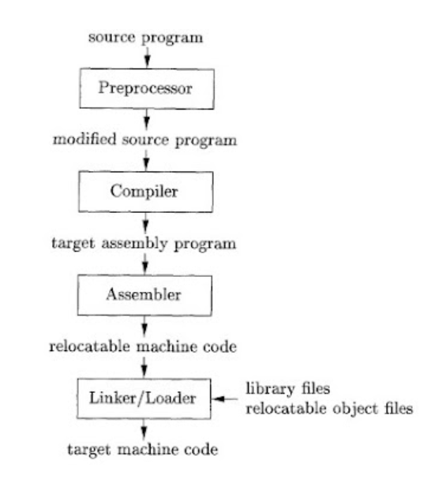
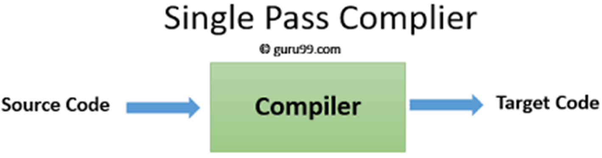
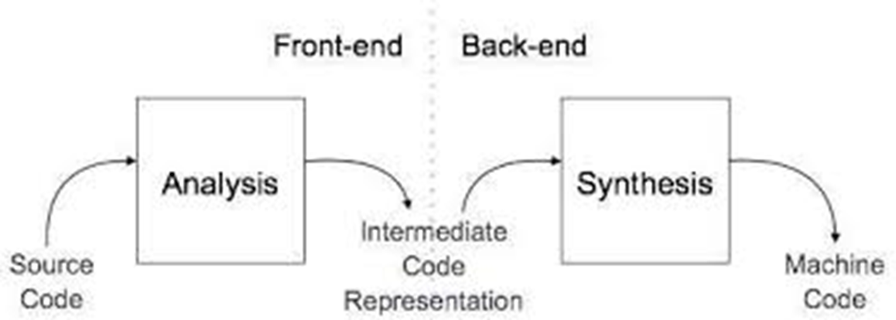
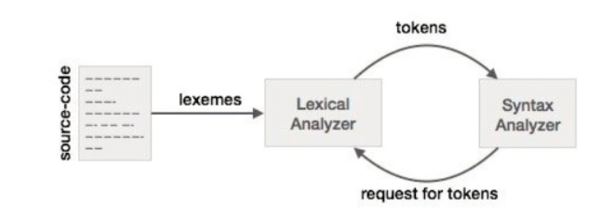

# What is the Compiler 
A compiler is a software. This is basically a special program that takes the code as input. The code is generally written in a high-level language and turns it into machine language that a computer can run.    

It acts as a translator, reading the source code, and producing optimized machine code.   

> It goes through several stages, like scanning, parsing, and checking meanings.
  - **Scanning :** ---> Lexical Analysis 
  - **Parsing :** ---> Synatx Analysis
  - **Checking :** ---> Symantic Analysis  

It is a fundamental tool for software development, and it makes computers to understand and execute our instructions written in higher level language.     

 

## Importance of Compilers   

**Compilers are essential tools** in modern programming that act as a bridge between human-readable code and a computer's machine language. They are vital for several reasons:

* **Abstraction**: Compilers allow programmers to write code in high-level languages like C++ and Python, which are much easier to understand and maintain than low-level binary or assembly code.
* **Performance Optimization**: They improve program efficiency by identifying and removing redundant code, rearranging instructions for better performance, and taking advantage of specific hardware features.
* **Error Detection**: Compilers check for common errors (like a missing semicolon or a type mismatch) before a program runs, which saves significant debugging time.
* **Portability**: Compilers make it possible to write code once and then compile it for different operating systems and hardware platforms, enhancing its reusability.
* **Reusability**: Once a program is compiled, it can be executed multiple times without needing to be translated again, making it more efficient than interpreted code.

 

## Why You Should Learn About Compilers

Understanding compilers is a fundamental skill that goes beyond just programming. It offers several key advantages for any computer science student or professional:

* **Deeper Understanding**: Learning about compilers gives you a better grasp of how programming languages and computer hardware work together.
* **Improved Problem-Solving**: The structured approach of compiler design—breaking down a large problem into smaller, manageable phases—is a valuable skill that applies to many other fields.
* **More Efficient Coding**: Knowing how a compiler optimizes code can help you write more efficient programs from the start.
* **Effective Debugging**: An understanding of compiler phases helps you interpret error messages and debug your code more effectively.
* **Broader Career Opportunities**: The principles of compiler design are used in many advanced fields, including data analysis, security, and hardware design.     

## Language Processing System
The hardware understands a language, which humans cannot understand. So we write programs in high-level language, which is easier for us to understand and remember. These programs are then fed into a series of tools and OS components to get the desired code that can be used by the machine. This is known as Language Processing System.        

  

### Components of a Language Processing System

* **Preprocessor**: This tool, often part of a compiler, it takes the source code and processes directives, such as including other files, expanding macros, or other forms of code augmentation, to prepare the code for the main compiler. 

  **File Inclusion (`#include`)**
* **Example**: In a C or C++ program, you often see `#include <stdio.h>`.
    * **Before Preprocessing**: Your code has the line `#include <stdio.h>`.
    * **After Preprocessing**: The preprocessor finds the file `stdio.h` (the standard input/output library header) and literally copies all its contents (function declarations for things like `printf` and `scanf`) into your source file. The compiler then sees the full list of these declarations and can correctly compile your code.

**Macro Expansion (`#define`)**
* **Example**: `pi` is often defined as a constant.
    * **Before Preprocessing**: You define a macro with `#define PI 3.14159` and then use it in your code, for example: `area = PI * radius * radius;`.
    * **After Preprocessing**: The preprocessor finds every instance of the word `PI` and replaces it with the text `3.14159`. The line becomes `area = 3.14159 * radius * radius;`. This avoids having to type the value multiple times and makes it easy to change the value in one place.   

* **Compiler**:   A compiler translates the entire source code of a high-level language into low-level machine code at once. It performs a complete analysis of the code, reports all errors found, and then generates an executable file. This process is more time-consuming upfront but results in a program that runs quickly.   

* **Interpreter**:    Unlike a compiler, an interpreter translates and executes source code one line at a time. It's useful for debugging because it stops and reports an error as soon as it's encountered. Interpreters are generally slower than compilers because they must translate each line of code every time the program is run.    

* **Assembler**:  An assembler's job is to translate assembly language (a low-level language that uses mnemonics for machine instructions) into machine code. The output is an object file that contains the machine instructions and data needed for a program.   

* **Linker**:   The linker combines multiple object files, which may have been created by different assemblers or compilers, into a single executable file. It resolves all the dependencies between files by finding and linking together various code modules and routines.   

* **Loader**: A loader is a part of the operating system that takes a completed executable file and loads it into the computer's memory. It allocates the necessary memory space and prepares the program for execution.   

## Architecture of Compiler 🏗️
The architecture of a compiler is fundamentally divided into two main phases: the **analysis phase** and the **synthesis phase**. This separation, also known as the **front end** and **back end**, respectively, is a standard design principle that makes compilers more modular and efficient.

### Analysis Phase (Front End) 🧐

The analysis phase is the first part of the compilation process. Its primary job is to analyze the source code and create an intermediate representation (IR) of the program. This phase is largely **language-dependent**, meaning it's specific to the programming language being compiled. It is concerned with understanding the structure and meaning of the source code.

This phase is typically broken down into three sub-phases:

1.  **Lexical Analysis (Scanning):** The source code is read character by character and grouped into meaningful units called **tokens**. It removes whitespace and comments. For example, the statement `int sum = a + b;` is broken down into tokens like `int`, `sum`, `=`, `a`, `+`, `b`, and `;`.
2.  **Syntax Analysis (Parsing):** This phase takes the stream of tokens and checks if they form a grammatically correct structure according to the language's rules. It builds a hierarchical representation of the code, often a **parse tree** or an **Abstract Syntax Tree (AST)**. If the syntax is incorrect, it reports an error. 
3.  **Semantic Analysis:** This phase goes beyond syntax to verify the logical correctness and meaning of the code. It checks for **semantic errors** like type mismatches (e.g., trying to add a string to an integer), using an undeclared variable, or calling a function with the wrong number of arguments. It also populates the **symbol table** with information about variables and functions.

***

### Synthesis Phase (Back End) ⚙️

The synthesis phase takes the intermediate representation (IR) generated by the analysis phase and translates it into the final target code. This phase is largely **machine-dependent**, meaning it's tailored to a specific hardware architecture. The goal is to generate efficient, optimized code for the target machine. 

This phase also consists of several sub-phases:

1.  **Intermediate Code Generation:** A low-level, machine-like intermediate code is generated from the AST. This representation is independent of the source language and the target machine, making it easier to perform optimizations. we consider an intermediate form called three-address code, which consists of a sequence of assembly-like instructions with three operands per instruction.
2.  **Code Optimization:** This is an optional but critical phase. It transforms the intermediate code to make it more efficient and faster. Optimizations include rearranging instructions, removing redundant code (**dead code elimination**), and leveraging specialized hardware features.
3.  **Code Generation:** In the final step, the optimized intermediate code is translated into the final **target machine code** (e.g., assembly language or binary). This involves making crucial decisions about which variables go into which CPU registers and how to manage memory.    

## ⚙️ **Types of Compiler**

### **1️⃣ Single Pass Compiler**

A **single pass compiler** reads the **source code only once** and directly translates it into machine code.

#### ⚙️ How it Works:
* Each line is analyzed and compiled as it’s read.
* It doesn’t need to store much intermediate data.
* Works well for **simple, small programs**.

**Example:** 
Old languages like **PASCAL**, **BASIC**, and **FORTRAN** used single-pass compilers.
| Advantages |  Disadvantages |
|------------|----------------|
| Fast compilation| Hard to optimize code|
|Less memory usage| Limited error detection (since it doesn’t recheck code)|

### **2️⃣ Two-Pass Compiler**
A **two-pass compiler** scans the source program **twice**.

#### ⚙️ How it Works:

* **Pass 1:** Collects information like declarations, symbol table, and checks syntax.
* **Pass 2:** Uses that information to generate the target (machine) code.

**Example:** 
Many **assembly compilers** use this approach first pass for labels, second for final code.

| Advantages |  Disadvantages |
|------------|----------------|
| Easier to handle forward references (like using a variable before declaring it)| Slower than single-pass because it reads the program twice.|
|More accurate code generation than single-pass| |

### 🧩 **3️⃣ Multi-Pass Compiler**

A **multi-pass compiler** processes the source code **in more than two passes**. 

Each pass handles a different stage like syntax, semantics, optimization, or code generation.

#### ⚙️ How it Works:

* Pass 1 → Lexical & Syntax Analysis
* Pass 2 → Semantic Checks
* Pass 3 → Optimization
* Pass 4 → Code Generation

**Example:**
Modern **C, C++, and Java compilers** are multi-pass.

| Advantages |  Disadvantages |
|------------|----------------|
|Better Optimization| Takes more time and memory|
|Better error Checking| | 
|Produces efficient machine code|  |

###  **4️⃣ Cross Compiler**

A **cross compiler** runs on one machine (host) but **generates code for another machine (target)**.

**Example:**
You compile a program on a **Windows PC** that runs on an **ARM microcontroller**.

⚙️ **Use Case:**
Common in **embedded systems**, IoT devices, and console game development.  

**Advantages:**
* Allows development for platforms that can’t compile code themselves
* Useful for testing on different architectures

###  **5️⃣ Parallelizing Compiler**

A **parallelizing compiler** automatically converts a program into a form that can run on **multiple processors simultaneously**.

#### ⚙️ How it Works:

* Analyzes loops and instructions
* Splits the work into parts that can run in parallel
* Helps in high-performance computing (HPC)

**Example:** 
Used in **scientific computing**, **supercomputers**, and **multi-core processors**.

| Advantages |  Disadvantages |
|------------|----------------|
| Faster execution on parallel hardware| Complex to design|
| Efficient use of multi-core CPUs| Not all code can be parallelized safely | 

### **6️⃣ Hybrid Compiler**

A **hybrid compiler** combines the features of both **compiler and interpreter**.

#### ⚙️ How it Works:

* First, the code is compiled into **intermediate code (bytecode)**.
* Then, the **interpreter** or **JIT compiler** executes that intermediate code.

**Example:**

* **Java**: Compiles to bytecode, then runs on the JVM (interpreted or JIT compiled).
* **Python (PyPy)**: Uses JIT compilation for speed.

| Advantages |  Disadvantages |
|------------|----------------|
|Faster than pure interpretation| Slight runtime overhead|
|More portable (runs on any system with the right runtime)| Requires both compiler and interpreter components | 

##  **Cousins of Compiler**

| 🧰 **Tool**        | 📝 **Input**             | ⚙️ **Output**                | 🔍 **How It Works**                                                                                                          | 💡 **Example**                                 |
| :----------------- | :----------------------- | :--------------------------- | :--------------------------------------------------------------------------------------------------------------------------- | :--------------------------------------------- |
| 🧩 **Assembler**   | Assembly Language        | Machine Code (Binary)        | Converts assembly instructions (e.g., `MOV AX, 10`) into binary code that the CPU can execute directly.                      | NASM, MASM                                     |
| 🌐**Translator**  | Any Programming Language | Another Form / Language      | A general program that converts code from one language or form to another. Includes compilers, assemblers, and interpreters. | Source-to-source translator (e.g., C → Python) |
| 💬**Interpreter** | High-Level Language      | Direct Execution (No `.exe`) | Reads and executes the code **line by line**, without generating a separate executable file.                                 | Python, JavaScript, Ruby                       |
| ⚙️ **Compiler**    | High-Level Language      | Machine Code / Bytecode      | Translates the **entire program** into machine code before execution, creating an executable file.                           | C, C++                                         |

   

## ⚔️ **Compiler vs Interpreter**

| Feature               | Compiler                                | Interpreter                              |
| --------------------- | --------------------------------------- | ---------------------------------------- |
| **Translation style** | Translates entire program at once       | Translates one line at a time            |
| **Execution time**    | Fast (code is already compiled)         | Slow (each line interpreted every time)  |
| **Output**            | Creates an executable file (e.g., .exe) | No executable file created               |
| **Error detection**   | Shows all errors after full compilation | Stops immediately when an error is found |
| **Memory usage**      | Uses more memory                        | Uses less memory                         |
| **Example Languages** | C, C++                                  | Python, JavaScript                       |

   

## **Advantages of Compiler over Interpreter**

✅ **Compiler Advantages:**

1. Program runs faster (already converted to machine code).
2. Once compiled, can be run many times without recompilation.
3. Error list is available at once after compilation.

⚠️ **Disadvantages:**

* Compilation takes time before execution.
* Uses more memory.
* Not suitable for quick debugging.

## **Advantages of Interpreter over Compiler**

✅ **Interpreter Advantages:**

1. Easier to test and debug stops exactly where the error occurs.
2. No need for compilation runs immediately.
3. Great for scripting and learning.

⚠️ **Disadvantages:**

* Slower execution.
* Code must be reinterpreted every time.
* Cannot distribute an executable file.    

## Symbol Table  
A **symbol table** is a key data structure in the **compiler’s analysis phases** that stores information about all identifiers (variables, functions, classes, etc.) in a program.
It helps the compiler **track, verify, and manage** these names efficiently.

### 📚 **Main Functions**

| 🔹 Function           | 🧠 Description                                                                                                 |
| :-------------------- | :------------------------------------------------------------------------------------------------------------- |
| **Stores Attributes** | Keeps details like name, type, scope, size, and parameters for each identifier.                                |
| **Efficient Lookup**  | Allows the compiler to quickly find information about identifiers for type checking, declaration checks, etc.  |
| **Scope Management**  | Manages which variables or functions are accessible in different parts of the program (local vs global scope). 
---

   

**Example**

For a statement like `x = y + 10;`, the symbol table helps the compiler:   

- Verify that x and y have been declared. 
- Check their data types to ensure the addition operation is valid.  
- Confirm that both variables are within the current scope.

   

# Phases of Compiler   

## 1. Lexical Analysis  
**Lexical analysis**, also known as **scanning**, is the first phase of a compiler. It reads the source code as a stream of characters and groups them into meaningful units called **tokens**. It remove the whitespace and comments. It's similar to how we break a sentence into words. The tool that performs this task is called a **lexical analyzer** or **scanner**.  

The lexical analyzer works closely with the syntax analyzer. It reads character streams from the source code, checks for legal tokens, and passes the data to the syntax analyzer when it demands.   
   

  

### Terminologies of Lexical Analysis

* **Token**: A token is a sequence of characters that represents a single, cohesive unit. It's the building block for the next phase, syntax analysis. Tokens are defined by rules, such as keywords, identifiers, operators, or literals.  

**Each token has two parts:**

- Token Name → Category (e.g., Identifier, Keyword, Operator)
- Attribute Value → Actual text from code (e.g., sum, +) or an index to where that value is stored in the symbol table.  

    * **Example**: In the code `int sum = 10;`, the tokens are `<keyword, int>`,   `<identifier, name>`, `<operator, "=">` or `<number, value>`, `<deliminator, ;>`

* **Lexeme**: A lexeme is the actual sequence of characters in the source code that forms a token. A single token can have multiple lexemes.
    * **Example**: For the token `<identifier>`, the lexemes could be `sum`, `x`, or `count`.
* **Pattern**: A pattern is a rule that describes the set of lexemes that can represent a specific token. These rules are usually defined using regular expressions.
    * **Example**: The pattern for an identifier might be a letter followed by any number of letters or digits.

### Lexical Error

A **lexical error** occurs when the lexical analyzer encounters a sequence of characters that doesn't match any of the defined patterns for a token. It's an issue with the "spelling" of the code at the character level.

* **Common Examples**:
    * **Invalid Characters**: Using a character that is not part of the programming language's alphabet, such as `@` or `$` in a language that doesn't support them. For example, `int @value = 5;`.
    * **Unterminated Strings**: A string literal that is missing its closing quote. For example, `print("hello world);`.
    * **Incorrectly Formed Numbers**: A number with an invalid format, such as `12.3.4`.

When a lexical error is found, the scanner reports the error and often attempts to recover and continue scanning to find more errors, but it cannot proceed to the next phase until the errors are fixed.   

**Ambiguity**  

A grammar G is said to be ambiguous if it has more than one parse tree (left or right derivation) for at least one string.  

Syntax analysis or parsing is the second phase of a compiler. In this chapter, we shall learn the basic concepts used in the construction of a parser.

We have seen that a lexical analyzer can identify tokens with the help of regular expressions and pattern rules. But a lexical analyzer cannot check the syntax of a given sentence due to the limitations of the regular expressions. Regular expressions cannot check balancing tokens, such as parenthesis. Therefore, this phase uses context-free grammar (CFG), which is recognized by push-down automata.

